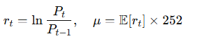
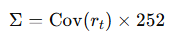
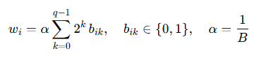
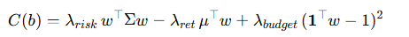
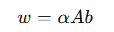

# Quantum Portfolio Optimizer

This project implements a **full-stack system** for portfolio optimization using both classical and quantum methods.  
The **backend** is built with **FastAPI** and leverages **PennyLane** to simulate quantum algorithms such as **QAOA** and **VQA**, alongside a classical heuristic baseline (**Simulated Annealing**).

---

## 🔹 Backend

The backend exposes a REST API that receives financial data (historical prices) and optimization parameters, and returns recommended portfolios generated by each method (SA, QAOA, VQA).

### ⚙️ Main Technologies
- [Python 3.10+](https://www.python.org/)
- [FastAPI](https://fastapi.tiangolo.com/)
- [Uvicorn](https://www.uvicorn.org/) (ASGI server)
- [Pandas](https://pandas.pydata.org/) and [NumPy](https://numpy.org/) for financial data processing
- [PennyLane](https://pennylane.ai/) and [Qiskit](https://qiskit.org/) for quantum algorithms
- [Scikit-learn](https://scikit-learn.org/) for PCA and classical utilities

### 📂 Backend Structure
backend/
│── app.py
│── requirements.txt
│── utils.py 
│── quantum_methods/ # Implementations of SA, QAOA, VQA
│ ├── sa.py
│ ├── qaoa.py
│ └── vqa.py

### 🧮 Mathematical & Quantum Foundations

This project combines modern portfolio theory, discrete optimization, and quantum-inspired algorithms to solve the investment allocation problem under budget, return, and risk constraints.

1. Financial Statistics

    * Annualized Returns (μ)
    Computed from the log-returns of adjusted closing prices:

    

    * Covariance Matrix (Σ):
    Estimated from the daily returns and scaled by 252 to reflect annual risk.

    

    These form the basis for measuring expected return and risk

2. Preselection of Assets

To avoid combinatorial explosion when M (number of available assets) is large, we preselect exactly k assets using heuristics:
  
   * Sharpe ratio → maximize risk-adjusted return.
   * High-return filter → pick assets with largest μ
   * Low-volatility & correlation (default) → pick assets that reduce redundancy and total variance.

3. QUBO Formulation

The portfolio allocation is cast as a Quadratic Unconstrained Binary Optimization (QUBO) problem.
Each asset i is represented with q binary variables encoding discrete weight units (binary expansion):

Where:

* q: number of bits per asset
* B: total units available (budget granularity)
* bik : binary decision variables

Final objective:

4. Solvers

The QUBO can be solved by:

* Simulated Annealing (SA) → fast, classical stochastic optimization.
* Quantum Approximate Optimization Algorithm (QAOA) (via PennyLane) → hybrid quantum-classical variational solver.
* Variational Quantum Algorithms (VQA) (future extension) → explore richer ansatz beyond QAOA.

5. Interpretation of Results

The solution vector b is decoded into portfolio weights:

where A is the binary expansion matrix.

The framework then outputs:

* Selected assets (tickers)
* Optimal weights (𝑤𝑖)
* Investment amounts in USD
* Portfolio metrics (expected return, volatility, cost function 𝐶)

6. In summary

We translate the portfolio optimization problem into a binary combinatorial model (QUBO), which can be tackled by quantum-inspired heuristics or quantum algorithms. This bridges traditional finance with cutting-edge quantum optimization.